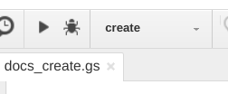

# Apps Script Tools

This is not an official Google product. It is not supported by the Dart team.

This package is still in an experimental state.

This package provides tools for using dart2js-compiled programs as Google Apps
scripts.

The `gsify` program adds boilerplate and necessary preambles, and the
`upload` program uploads the resulting `gs` script to Google Drive.

The `main` program makes the development process easier by automatically
using those two tools whenever the input JS file is changed.

See also [clasp](https://github.com/google/clasp) for a similar tool that isn't
specialized for Dart, but supports more operations.

## Usage

The most common use case is to watch the output file of a dart2js
compilation and upload it as Google Apps script whenever it changes.

This is accomplished with the `main`-script (aka `apps_script_watch` when
enabled through `pub global activate`).

In its simplest form it just needs two arguments: the input file and
a Google Drive destination. Every time the input file changes (and also
initially at startup) it converts the JS file into a valid
Google Apps script (prefixing it with a necessary preamble) and then
uploads it to Google drive at the given location. (This requires an
OAuth authentication).

Similar to `gsify` it can also add stub functions (see "Stub Functions"
below) or the
`/* @OnlyCurrentDoc */` or `/* @NotOnlyCurrentDoc */` comments (see
https://developers.google.com/apps-script/guides/services/authorization).

*Note that Google Apps script must be compiled with the `--cps` flag of
dart2js.*

Example
```
pub global activate apps_script_tools
apps_script_watch in.js folder/script_name
```
or, without running `pub global activate`
```
pub global run apps_script_tools:main in.js folder/script_name
```

### Gsify

The `gsify` executable converts a dart2js-compiled program into a valid
Google Apps script.
It prefixes the necessary preamble and optionally add some stub functions,
and `/* @OnlyCurrentDoc */` or `/* @NotOnlyCurrentDoc */` comments (see
https://developers.google.com/apps-script/guides/services/authorization).

The input file must be the output of `dart2js` with the `--cps` flag.

Example:
```
pub global activate apps_script_tools
apps_script_gsify in.js out.gs
```

The following example adds the `/* @OnlyCurrentDoc */` comment and a
stub-function called `onOpen`:
```
apps_script_gsify -s onOpen --only-current-document in.js out.gs
```

### Upload

`upload` takes a valid Google Apps script and uploads it to Google Drive.

If there exists already a Google Apps script at the provided destination
replaces the content with the given input script. This only works if the
existing Google Apps script only contains one source file.

The destination may be prefixed with folders (which must exist).

This script uses Google APIs and thus requires an OAuth authentication
which is cached for future uses.

Example:
```
pub global activate apps_script_tools
apps_script_upload in.gs folder/script_name
```

### Run

`run` executes the uploaded script. Scripts must be run in the same
Google Cloud project as the Google API that makes the invocation. This
means that the request to run the script must use a clientId/Secret that
is provided by the user.

See below ("Remote Script Execution") for detailed instructions on how to
set this up.


## Stub Functions
Whenever the Google Apps Script service needs to call into the provided script
it needs to statically see the target function. That is, the provided
JavaScript must contain a function with the given name. For example,
Spreadsheet Addons that want to add a menu entry must have a statically visible
`onOpen` function. The output of dart2js avoids modifying the global environment
and the current JS interop functionality does not give any means to export a
Dart function. To work around this limitation, one can use a stub function that
is then overwritten from within the Dart program.

Concretely, running `main` or `gsify` with `-s onOpen` will add the following
JavaScript function to the generated `.gs`:

``` JavaScript
function onOpen() {}
```

From within Dart one can then use JS interop to overwrite this function before
it is invoked:

``` dart
@JS()
library main;

import 'package:js/js.dart';

@JS()
external set onOpen(value);

void onOpenDart(e) {
  // Run on-open things like adding a menu.
}

main() {
  onOpen = allowInterop(onOpenDart);
}
```

This (or a similar setup) must be done for any function that the Apps framework
wants to use as an entry point. This includes simple triggers (see
https://developers.google.com/apps-script/guides/triggers/), the  menu entries,
and callbacks from html services
(https://developers.google.com/apps-script/guides/html/reference/run).

## Running Scripts

### Using the Script Editor

The easiest way to run a script is to upload it (using one of the provided
tools), and then run a function from within the Script Editor.

The Script Editor is not connected by default in Google Drive. If the
uploaded script doesn't open on double-click: go to
 "New" -> "More" -> "Connect more apps" and connect "Google Apps Script".

The Editor allows to run (statically visible) functions directly.

#### Bound Scripts / Addons
Scripts that should be run on an opened document/spreadsheet are called
"bound scripts" or "addons".

The Script Editor has a convenient 'Test as add-on...' functionality which
opens a file with the script running as add-on.

### As a Shared Library
Instead of using Script Editor's "Test as add-on...", one can also create a
bound script directly and then use the uploaded script as a shared library. This
approach has the advantage that the script will also be loaded when the document
is opened outside the editor. It also makes it possible for other users to use
the script without needing to publish it.

1. Create a saved version of the script you want to use as a shared library. (File -> Manage versions).
1. Create a bound script: "Tools" -> "Script Editor" from within a open
file (document, spreadsheet, ...).
2. Save the project and give it a name.
3. Link the uploaded script as shared library: Resources -> Libraries -> Add a library.
  Don't forget to enable the "Development mode". This way uploads to the script are
  immediately visible to you (but not other users).

Once that's in place, one just needs to forward functions to the shared library.
For example, the following bound script forwards the `onOpen` and `hello`
functions from the bound script to the shared library (imported with the
identifier "dart"):

``` JavaScript
function onOpen(e) { dart.onOpen(e); }
function demo() { dart.demo(); }
```

Interestingly, it's not necessary to forward menu functions. In fact, it's
possible to create menu entries that call immediately into the shared
library. In this case, the function does not even need a stub.

For development it's thus convenient to forward the prefix to Dart's
`onOpen` function:

``` JavaScript
function onOpen(e) { dart.onOpen(e, "dart"); }
```

Inside Dart, one can then use this information to set up menu entries
without needing to deal with forwarders or stub functions.

``` dart
@JS()
external set onOpen(value);

@JS()
external set hello(value);

void onOpenDart(e, [String prefix]) {
  if (prefix == null) {
    prefix = "";
  } else {
    prefix = "$prefix.";
  }
  SpreadsheetApp
      .getUi()
      .createMenu("Dart")
      .addItem("hello", "${prefix}hello")
      .addToUi();
}

void helloDart() {
  SpreadsheetApp.getUi().alert("Hello World");
}

main() {
  onOpen = allowInterop(onOpenDart);
  hello = allowInterop(helloDart);
}
```

### Using Google APIs
Google Apps script that have been uploaded to Google Drive can be invoked with
Google API calls. The [Executing Functions using the Apps Script API Guide](https://developers.google.com/apps-script/api/how-tos/execute)
explains how to remotely execute a specified Apps Script function.

Fundamentally, the call needs the following information:
- the ID of the script project which can be found in the project's
  properties (see "Shared Library" above).
- the name of the function to execute. The corresponding Dart function
  must be exported with a stub (see above).
- the arguments.

However, the `scripts.run` API has one important restriction: the script
being called and the calling application must share a Cloud Platform
project.

One can either use the default one created for each script, or move the
script to a different project:
https://developers.google.com/apps-script/guides/cloud-platform-projects#switch_to_a_different_google_cloud_platform_project

The walk-through below details the necessary steps.


## Walk-throughs
This section step-by-step instructions on common tasks.

For all examples we assume a `pubspec.yaml` depending on the
`google-apps` and `js` package:

```
name: example
description: Example for Google Apps scripting in Dart.
version: 0.0.1
#homepage: https://www.example.com
author: <Insert Author>

environment:
  sdk: '>=1.20.1 <2.0.0'

dependencies:
  js: ^0.6.1
  google_apps: ^0.0.1
```

### Create Document
In this example we write a script that creates a new document.

Create the following `bin/doc.dart` file inside your project:

``` dart
@JS()
library example;

import 'package:js/js.dart';
import 'package:google_apps/document.dart';

@JS()
external set create(value);

void createDart() {
  var document = DocumentApp.create("doc- ${new DateTime.now()}");
  var body = document.getBody();
  body.appendParagraph("Created from Dart").editAsText().setFontSize(32);
}

void main() {
  create = allowInterop(createDart);
}
```

Compile it with dart2js:

```
$ dart2js --csp -o out.js bin/doc.dart
```

Upload it Google Drive as a Google Apps script:
```
$ apps_script_watch -s create out.js docs_create
```

After authentication, the tool uploads the script as Google Apps script.

Open it in Google Drive. If it doesn't work ("No preview available")
connect the "Google Apps Script" app first:
1. New -> More -> Connect more apps
2. Search for Google Apps Script and connect it.

In the editor select "create" in the listed functions and press run:



The first time the script is run it will ask for permissions, and then
create a new Google Docs document.

### Hello World Addon
In this section we create a script that is bound to a document.

First create a new spreadsheet. Alternatively you can create a Google Docs
document, but you would need to change a few lines below.

Create the following `bin/sheet.dart` program:

``` dart
@JS()
library hello_docs;

import 'package:js/js.dart';
import 'package:google_apps/spreadsheet.dart';

@JS()
external set sayHello(value);

@JS()
external set onOpen(value);

void sayHelloDart() {
  SpreadsheetApp.getUi().alert("Hello world");
}

void onOpenDart(e) {
  SpreadsheetApp
      .getUi()
      .createMenu("from dart")
      .addItem("say hello", "sayHello")
      .addToUi();
}

main(List<String> arguments) {
  onOpen = allowInterop(onOpenDart);
  sayHello = allowInterop(sayHelloDart);
}
```

Compile it with dart2js:
```
dart2js --csp -o out.js bin/sheet.dart
```

Upload it to Google Drive:
```
$ apps_script_watch -s onOpen -s sayHello out.js hello
```

Open the uploaded script in the Apps Script Editor. If a double-click
on the script doesn't work ("No preview available") see the first example.

In the editor run the application by testing it as an addon:


Note that the script will add an entry in the `Add-ons` menu. If
the script had been run as a bound script, it would add the menu directly
into the main menu. We can achieve this effect by using the uploaded
code as a shared library.

#### Shared Library
Go back to the script editor from where we launched the add-on test.

Save a new version: File -> Manage versions

Find the script-id. It's available in the URL, or in "File" -> "Project properties".

Now go back to the spreadsheet where we want to run this script in.

From within the spreadsheet open the Script editor ("Tools" -> "Script Editor").

Copy the following code into the editor (usually "Code.gs"):

``` JavaScript
function onOpen(e) { hello.onOpen(e); }
function sayHello() { hello.sayHello(); }
```

Save the project and give it a name.

Go into "Resources" -> "Libraries".

Add a new library, using the script-id we retrieved earlier.

Use the latest version.

Verify that the "Identifier" is correctly set to "hello". (You can also
use a different identifier, but then you need to update "Code.gs").

Enable "Development mode". This way a new upload of the apps script is
immediately used. Note, however, that other users only see the selected
saved version.

Open the spreadsheet again (or reload it). It should now add a new menu
entry "from dart".


### Remote Script Execution
Start by finishing the "Create Document" tutorial above. You should now
have a script "docs_create" in Google Drive.

Open it with the Script Editor.

First retrieve the project id and the necessary scopes for this project:
- "File" -> "Project properties"
- Write down the Script ID
- Switch to the "Scopes" tab
- Write down the listed scopes (it should just be one:
 "https://www.googleapis.com/auth/documents").

Publish the script so that the Script's API can find it:
"Publish" -> "Deploy as API executable".

Now go to "Resources" -> "Cloud Platform project".

In the opened window, the editor shows the project the script is currently
associated with. Click on the link. This brings you to the
"Google Cloud Platform" page.

In the "Getting Started" section click on
"Enable APIs and get credentials like keys".

Enable the Scripting API:
- Click on "ENABLE APIS AND SERVICES"
- Search for "Google Apps Script API" and Enable it.

Create new OAuth credentials:
- Go to the Credentials tab.
- Click on the "Create Credentials" pop-down and select "OAuth client ID".
- Chose "Other" and enter a name.

A new window reveals a "client ID" and "client secret".

Use those two strings as follows to run the script remotely from the
command line:
```
$ pub global run apps_script_tools:run -s [SCOPE] --client-id [CLIENT_ID] --client-secret [CLIENT_SECRET] [SCRIPT_ID] create
```
If there are multiple scopes, each of them must have its own "-s"
parameter to the `run` script.

If the script takes parameters, they can be added after the function name.

## Features and bugs

Please file feature requests and bugs at the [issue tracker][tracker].

[tracker]: https://github.com/google/apps_script_tools/issues
